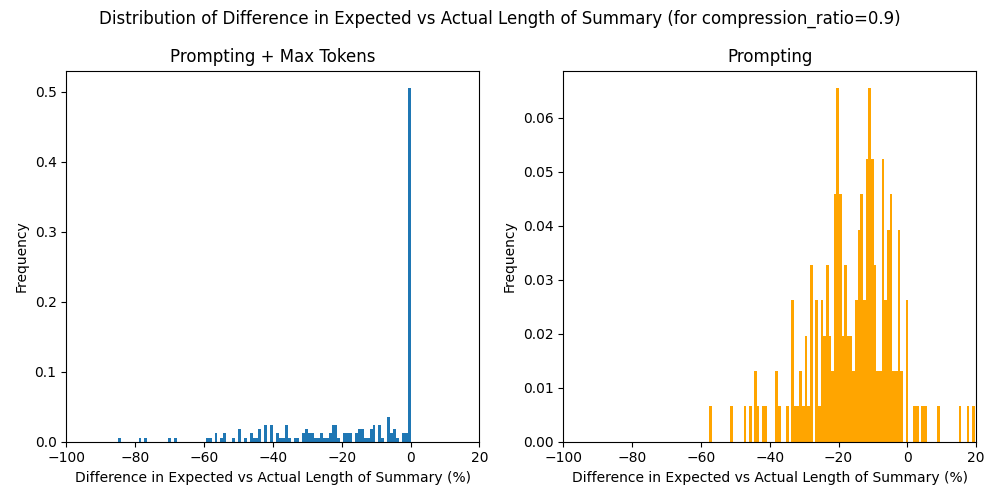
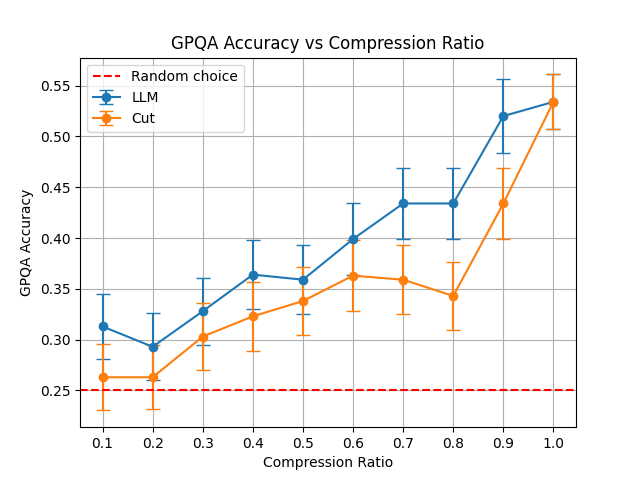

# GPQA Summarization Task

This task is designed to measure the performance of a language model when given a summarized version of a question from a knowledge-based reasoning task.

> [!NOTE]
> I have spent a total of 5 hours on this task. Separated in 1.5 hours of reading and understanding the assignment and implementing the baseline (during Jan 21), and ~3.5 hours of coming up with the basic summarization mechanism, setting up the experiment and writing this report (during Jan 26). Since I was time constrained, my main objective was to run the basic experiment, justify my choices and suggest future work and other possible ideas to improve the general setup and summarization mechanism.

## Setup

We will be using the Diamond subset of the [GPQA dataset](https://github.com/idavidrein/gpqa) for this task. The objective is to design a (parameterizable) summarization mechanism for the GPQA questions and evaluate the performance degradation of a language model when given a summarized version of the question.

To evaluate the performance of a language model, we will be using the [Inspect](https://github.com/UKGovernmentBEIS/inspect_ai/tree/d3f6cb47f0b7332528186b57261bd91b9ac44c3b) framework from the UK AISI, as it already has the baseline GPQA task implemented and it allows easy modification of the task to include a summarization mechanism.

By default, we will be using gpt-4o-2024-08-06 as the language model. As hyperparameters for the task, we will be using the score across a single epoch for each question (best-of-1 score), and using CoT prompting for the language model (following the implementation in OpenAI's [simple-evals](https://github.com/openai/simple-evals) to match the baseline GPQA score for GPT-4o).

## Summarization Mechanism

In this task we compare two summarization mechanisms. The first is the extremely simple baseline of cutting the question at a certain token length. The second is a baseline summarization mechanism in the form of a prompt template that uses a call to a "summarizer" model that will generate a summary of the question. The parameterization for the summarizer comes in form of a cutoff in token length for the summary by using the `num_completion_tokens` parameter OpenAI's API. This way, we can assert that both mechanisms are using the same amount of maximum tokens for the summarization. We implement both mechanisms using custom `solver` functions [here].

<details>
<summary>Summarizer prompt template</summary>

```
Provide a summary of this scientific question while keeping all critical technical terms and relationships and preserving the core question being asked:

{input}

Provide only the summary, no additional explanation, use all the text you need.

Summarized question:
```

</details>

There are several alternatives that I considered for the summarization mechanism. I discuss them, as well as the reasoning behind the final choice below (in order of simplicity):

- **Classical summarization via text analysis**: This is the most straightforward approach to summarization, it includes a variety of techniques ranging from the simplest: cutting down the question to fit a certain token length, to more sophisticated heuristics/techniques such as lemmatization, stemming and keyword extraction. This is easy to parameterize, and it might be a decent heuristic to summarize the question in a low compression ratio regime. However, with a high compression ratio, this approach has no semantic understanding of the question and it might not be able to preserve the core question being asked.

- **Summarization via a call to a "summarizer" model with prompt engineering**: This is similar to the approach implemented in this task, but it uses a different approach to the summarization mechanism. Instead of using a cutoff in token length, it uses a prompt template that asks the summarizer model to summarize the question in a certain number of tokens/words/sentences. Simple experiments have shown that neither gpt-4o nor claude-3.5-sonnet are able to stick to the number of tokens/words in the prompt template reliably, and thus this yields this approach to be less reliable than the cutoff in token length approach.

- **Summarization via a call to a "summarizer" model with a cutoff in token length**: This is the approach implemented in this task. It is simple, easy to parameterize and it is a good baseline to compare with other approaches. In low compression ratio regimes, it allows the LLM to rewrite the question within the cutoff. In high compression ratio regimes, it allows the LLM to rewrite but might stop it mid-sentence. Below, we show a plot that compares the number of tokens used in this schema vs the previous one (relying on only prompting to moderate the number of tokens used).



What we see is that by using a simple prompt template and the cutoff by `max_completion_tokens` we can get a summary that is close to the expected number of tokens, making it a good baseline to compare with the cutting approach.

As future work, I think it is intuitively clear that having a good underlying understanding of the question and its topic is key to being able to summarize it well. For this reason, I think using capable language models for summarization is the best approach. In terms of how to help the model use all the available tokens it has, a better approach might be to use a custom sampling strategy that takes into account how many tokens does the model have available, since making all the available tokens might improve the quality of the summary.

## Results

### Baseline Evaluation

First, to test our setup, we test the no-summarization baseline.

|       Model       | Accuracy | Stderr |
| :---------------: | :------: | :----: |
| gpt-4o-2024-08-06 |  0.543   | 0.027  |

We get a mean accuracy of 0.543 with a standard deviation of 0.027. This is coherent with the results reported in the [simple-evals](https://github.com/openai/simple-evals) repository for the GPQA task and gpt-4o-2024-08-06.

### Improvement over the baseline

A straightforward possible improvement over the baseline is to use self-critique on the model response, i.e. to use the same model to generate the response and then to critique it, this allows the model to pseudo-reason about its own response in plain text to be able to improve it. A simple implementation of self-critique is already present in the Inspect framework. Adding it to the solver pipeline yields the following results:

|               Model               | Accuracy | Stderr |
| :-------------------------------: | :------: | :----: |
|         gpt-4o-2024-08-06         |  0.543   | 0.027  |
| gpt-4o-2024-08-06 (self-critique) |  0.552   | 0.021  |

As we can see, the accuracy increases in our evaluation, however, the self-critique mechanism does not yield a statistically significant improvement over the baseline.

### Summarization Evaluation

Next, we evaluate the summarization mechanism.

For this, we have a single hyperparameter, the _compression ratio_, which we define as the ratio of the length of the summarized question to the length of the original question.

We sweep over a range of compression ratios, from 0.1 to 0.9, and evaluate the performance of the language model when given a summarized version of the question using both of the summarization mechanisms described above (cutting the question at a certain token length, and using a summarizer model + `max_completion_tokens`). The results are shown in the figure below:



As we can see, the accuracy of the language model decreases as the compression ratio increases. This is expected, as the summarization mechanism is designed to reduce the length of the question, and thus the amount of information that the language model has to process.

## Conclusion

In this task, we investigated two approaches to question summarization in the GPQA task: a simple token-length cutoff method and an LLM-based summarization mechanism. The findings can be summarized as:

- The baseline GPT-4 model achieved an accuracy of 54.3% on the original GPQA questions, consistent with previously reported results. A simple improvement in the form of self-critique slightly improved performance to 55.2%, although this improvement was not statistically significant.
- Both summarization methods showed clear performance degradation as compression ratio decreased, with the LLM-based summarizer consistently outperforming the simple cutoff method across most compression ratios. This suggests that semantic understanding of the question content helps preserve critical information even under significant compression. Although more experiments are needed to confirm this hypothesis.
- The LLM-based summarization approach maintained relatively stable performance (around 40% accuracy) even at moderate compression ratios (0.5-0.8), while the cutoff method showed more volatile performance in this range. However, both methods converged toward random-choice performance (25%) at very low compression ratios (0.1-0.3).

For future work, we recommend:

- Exploring more sophisticated token allocation strategies that could help the summarizer model make better use of available tokens
- Investigating hybrid approaches that combine classical text analysis with LLM-based summarization
- Testing the approach with different model architectures to understand how summarization affects/is affected by different types of language models
- Analyzing specific question types to identify which categories are most/least affected by summarization

This initial investigation demonstrates that while question summarization inevitably leads to some performance degradation, LLM-based approaches can help preserve crucial information better than simple truncation methods.

## Instructions to replicate the experiments

1. Clone the repository
2. To get the baseline performance, follow the instructions for the [GPQA task](https://github.com/UKGovernmentBEIS/inspect_evals/tree/main/src/inspect_evals/gpqa). Specifically, run:

```bash
inspect eval inspect_evals/gpqa_diamond --model openai/gpt-4o
```

3. To get the summarization performance, run a sweep over the `compression_ratio` hyperparameter:

```bash
inspect eval inspect_evals/gpqa_diamond_compressed --model openai/gpt-4o -T compression_ratio={your_compression_ratio} -T summarization={your_summarization_method}
```

where `your_compression_ratio` is a float between 0 and 1, and `your_summarization_method` is either `llm` or `cut`.

4. Export the accuracy and stderr results to a CSV file from the Inspect dashboard.
